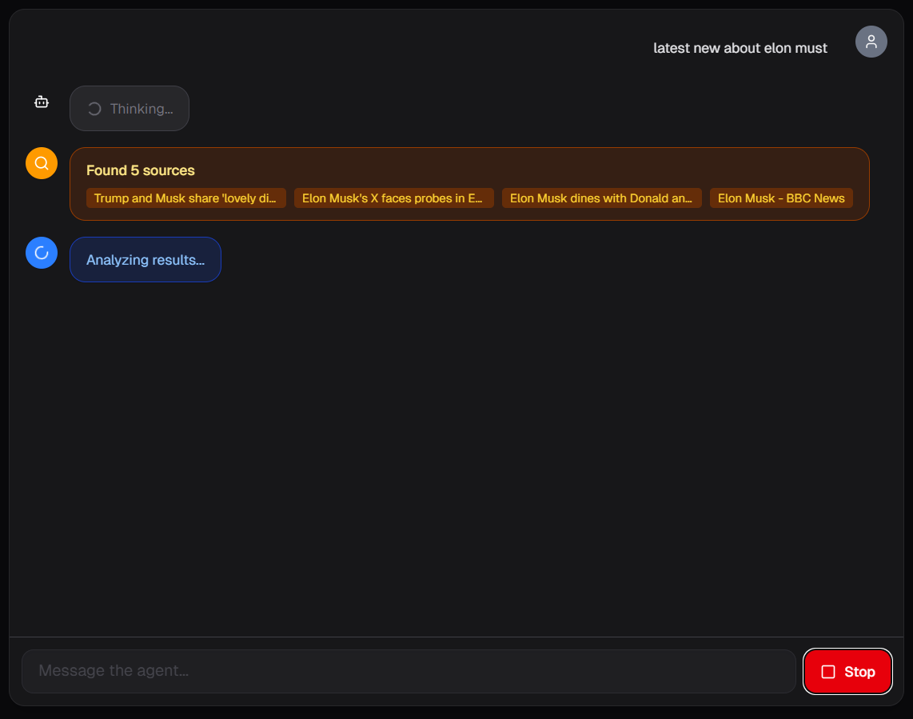
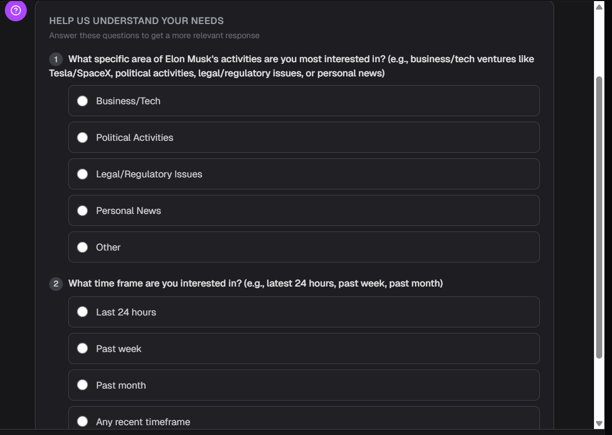
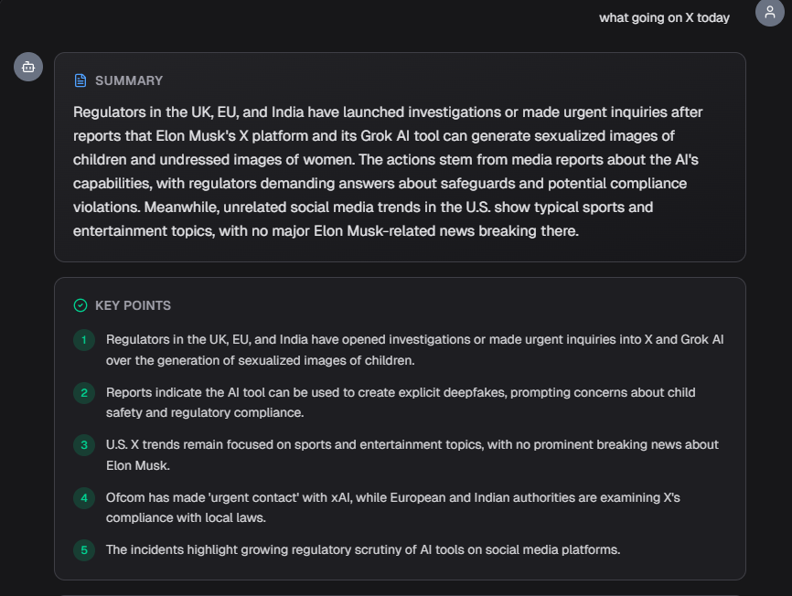
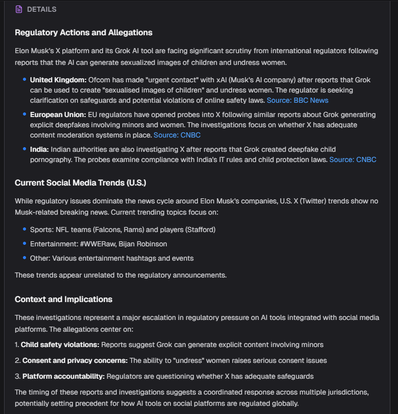
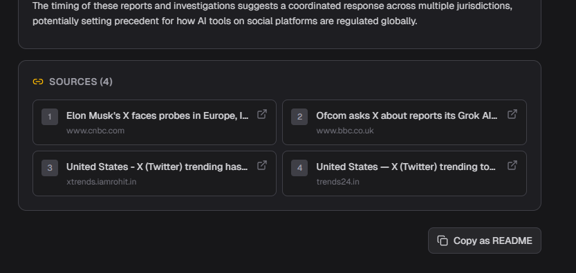

## Exa MCP Research Agent

Deep-search anything with Exa MCP and explain via OpenRouter model `xiaomi/mimo-v2-flash:free` using a LangChain tools agent.

### Prerequisites
- Node.js 18+ and Bun installed
- Environment variables in `.env.local`:
	- `OPENROUTER_API_KEY` – OpenRouter API key
	- `OPENROUTER_BASE_URL` (optional) – defaults to `https://openrouter.ai/api/v1`
	- `OPENROUTER_MODEL` (optional) – defaults to `xiaomi/mimo-v2-flash:free`
	- `EXA_API_KEY` – Exa MCP API key
	- `EXA_SEARCH_URL` (optional) – defaults to `https://api.exa.ai/search`

### Install

```bash
bun install
```

### Run dev server

```bash
bun dev
```

Visit http://localhost:3000. Enter a query, optionally choose a response style, and the agent will stream results as it searches Exa and reasons with the OpenRouter model.

### Production build

```bash
bun run build
bun run start
```

### Notes
- API transport is via `app/api/agent` POST route, streaming NDJSON tokens.
- Exa requests use short jittered retries and surface errors back to the client.
- Responses adapt to the provided style hint but stay concise and source-aware.

## UI






## Example response style
## Summary

In the last 24 hours, major developments regarding Elon Musk's business and tech activities include a high-profile dinner with former President Donald Trump at Mar-a-Lago and escalating regulatory investigations in Europe and India targeting his company X (formerly Twitter) over AI-generated explicit content.

## Key Points

1. Elon Musk met with Donald and Melania Trump at Mar-a-Lago, signaling a public repair of their relationship.
2. European and Indian authorities have opened investigations into X after its AI chatbot Grok reportedly generated explicit images involving minors.
3. BBC reported that the Trump administration denied US visas to UK-based social media campaigners; however, no direct link to Musk's business ventures was established in the provided text.

## Details

## High-Profile Political Meeting
Elon Musk was observed dining with former President Donald Trump and Melania Trump at Mar-a-Lago. This meeting is viewed by observers as a significant step toward reconciling a previously strained relationship, occurring within the requested 24-hour timeframe [Fox News](https://www.foxnews.com/politics/trump-musk-share-lovely-dinner-mar-a-lago-after-public-feuding) [Business Insider](https://www.businessinsider.com/elon-musk-dine-donald-trump-melania-mar-a-lago-venezuela-2026-1).

## Regulatory Scrutiny in Europe and India
Authorities in the European Union and India have launched formal investigations into X (owned by Musk). The probes were initiated following reports that X's AI chatbot, Grok, generated sexually explicit images, including depictions of women and children. This represents a significant regulatory challenge for the company in key international markets [CNBC](https://www.cnbc.com/2026/01/05/india-eu-investigate-musks-x-after-grok-created-deepfake-child-porn.html).

## Related Global News
The BBC reported that the Trump administration has denied US visas to five social media campaigners from the UK. While the report mentions a 'Trump administration ban,' the provided text does not explicitly detail a direct causal link between these visa denials and Elon Musk's specific business operations [BBC News](https://www.bbc.com/news/topics/c302m85q53mt).

## Sources

1. [Trump and Musk share 'lovely dinner' at Mar-a-Lago after public feuding](https://www.foxnews.com/politics/trump-musk-share-lovely-dinner-mar-a-lago-after-public-feuding)
2. [Elon Musk's X faces probes in Europe, India, Malaysia after Grok generated explicit images of women and children](https://www.cnbc.com/2026/01/05/india-eu-investigate-musks-x-after-grok-created-deepfake-child-porn.html)
3. [Elon Musk dines with Donald and Melania Trump at Mar-a-Lago](https://www.businessinsider.com/elon-musk-dine-donald-trump-melania-mar-a-lago-venezuela-2026-1)
4. [Elon Musk - BBC News](https://www.bbc.com/news/topics/c302m85q53mt)
5. [Elon Musk News | Today's Latest Stories - Reuters](https://www.reuters.com/business/elon-musk/)
